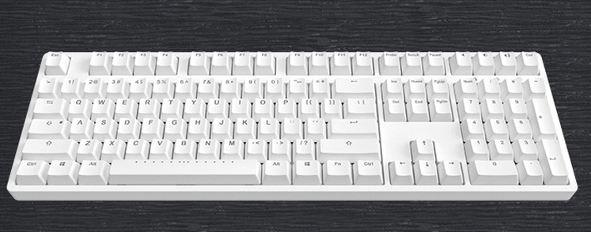

If you are like me a geek of preferring to use keyboard to operate your Windows system, then here is the right place for you.

The `goal` of MetaKB is described by the below gif:


## Description

MetaKeyboard redefined the CapsLock key as a function key:

- If you press it, it act like the ESC key;
- If you hold it and press another key, it could act like another `FUNCTION` key (like: <kbd>ctrl</kbd>, <kbd>alt</kbd>) for you.

> you can press CapsLock+` to toggle on/off the CapsLock key.

> below we use 'GK' to stands for 'GlobalKey', it could be configured, by default it configured as the `Space`.

# Keyboard Map

## Direction Keys Mapping Table

| Key  | Map        | Note |
| ---- | ---------- | ---- |
| GK+j | `Left`     |
| GK+k | `Down`     |
| GK+i | `Up`       |
| GK+l | `Right`    |
| GK+h | `Home`     |
| GK+; | `End`      |
| GK+u | `PageUp`   |
| GK+n | `PageDown` |

> The `LAlt(left Alt)` key combined with the keys in this table gives you a shortcut:
> i.e. if you want to press `Alt+Up` you could just press `LAlt+i`, no need to press `Alt+GK+i` together.

> Note: the `RAlt` still act as normal `Alt` key.

## Other Remapped Keys

| Key            | Map                        | Note                                                  |
| -------------- | -------------------------- | ----------------------------------------------------- |
| `GK+1..=`      | `F1..F12`                  | F1 -> GK+1 ... F10 -> GK+0, F11 -> GK+ -, F12 -> GK+= |
| `GK+Backspace` | `Delete`                   |
| `GK+'`         | `Context Menu`             | show context menu, the same as `App` key              |
| `GK+p`         | `PrintScreen`              |

## KeyboardMouse
| Key            | Map                        |Note                                                   |
| -------------- | -------------------------- | ----------------------------------------------------- |
| `GK+[`         | mouse `left` button click  |
| `GK+]`         | mouse `right` button click |

# Function and Software

## Frequently Used Function

| Key                                               | Map                                 | Note                                                          |
| ------------------------------------------------- | ----------------------------------- | ------------------------------------------------------------- |
| `Win+f`                                           | go to FileExplorer's files pane     | move focus to files pane of FileExplorer to manage files      |
| `Win+n`                                           | go to FileExplorers navigation pane | move focus to navigation pane of FileExplorer to manage files |
| `GK+\` |copy file full path| when in FileExplorer |
| `Ctrl+Alt+c`                                      | copy and search with search engine  | press `ctrl+c` and search with `Google`                       |
| `Ctrl+Alt+n`                                      | create new file in the folder       |
| `Win+v`                                           | open virtual machine manager        | configurable, default is Hyper-V                              |

### MetaKB related

| Key              | Function                                                                    |
| ---------------- | --------------------------------------------------------------------------- |
| `Ctrl+Win+Alt+l` | reload the metaKB software, environment variables and path would be updated |
| `Ctrl+Win+Alt+c` | close the metaKB software                                                   |

## Frequently Used Software

| Key          | Map                                                            | Note                                                                                                                                                                              |
| ------------ | -------------------------------------------------------------- | --------------------------------------------------------------------------------------------------------------------------------------------------------------------------------- |
| `GK+c`       | open the folder with _code_ editor                             | configuralbe, default is `VSCode`                                                                                                                                                 |
| `GK+d`       | show/hide your word dictionary software                        | in your favorite `dictionary` software config the hotkey `shift+alt+d` to toggle the software, and make sure to config your dictionary software auto start when windows starting. |
| `GK+e`       | edit file with configured editor                               | configurable, default is `gvim`                                                                                                                                                   |
| `GK+f`       | search in folder                                               | configurable, default is `everything` in the _software_ folder                                                                                                                    |
| `GK+t`       | open terminal                                                  | configurable, default is `Cmder` in the _software_ folder                                                                                                                         |
| `GK+w`       | open web explorer and navigate to your _searchEngine_          | configurable, default is `Google`                                                                                                                                                 |
| `GK+shift+w` | open web explorer and navigate to your _searchEngineSecondary_ | configurable, default is `Bing`                                                                                                                                                   |
| `GK+m s`     | start screen capture tool                                      | after starting, use the shortcut key config in the software to trigger screen capture.                                                                                            |
| `GK+m Alt+s` | start screen gif recorder                                      | configurable, default is `ScreenToGif` in the _software_ folder                                                                                                                   |
| `GK+m t`     | open task manager                                              | configurable, default is `ProcessExplorer` in the _software_ folder                                                                                                               |
| `GK+m r`     | screen ruler                                                   | configurable, default is `aruler` in the _software_ folder                                                                                                                        |
| `GK+m v`     | open all \*.sln files in the folder with visualStudio          | configurable                                                                                                                                                                      |

> configurable means could be configured in config.ini file

## Tricks

1. in file explorer, find the frequently used button on the Ribbon, and right click, select `Add to quick access toolbar`, base on the order, you can press `Alt+1..`to trigger this command. for example, I usually add the checkbox `Navigation pane` to the `quick access bar` so I can press `Alt+1` to show/hide it.

# Development

## Debug

to run the index.ahk file your need to install [AutoHotkey](https://autohotkey.com/download/), and run the follow command in the repository folder:

```
mklink config.ini .\metaKeyboard\config.ini /H
mklink software .\metaKeyboard\software /J
```

# Other Useful Programs and configuration

1. [VSCode](https://github.com/Microsoft/vscode) with plugins: Settings Sync, vim, metaGo....; configuration file is:
   GITHUB GIST: https://gist.github.com/metasong/b227db6a892b4c3ec1bb4900bc54977b. after install vscode and install the Settings Sync plugin, and sync settings with the gist file.
1. VisualStudio: the shortcut keys are reconfigured, configuratin is VSCode.vsk in the ./software/VisualStudioShortcut foler. Copy the VSCode.vsk into the folder: C:\Program Files (x86)\Microsoft Visual Studio 14.0\Common7\IDE or create a symble link point to to the VSCode.vsk pointing to it. and select the VSCode keyboard mapping scheme in your VS options: Environment/Keyboard config page. VS Extensions used: AceJump, Hide Main Menu Hot Commands for Visual Studio, Hot Keys - Keyboard Shortcuts, MixEdit, Resharper Ultimate,Visual Commander, VsVim
1. [ClipJump](https://github.com/aviaryan/Clipjump)
1. [Git for Windows](https://git-scm.com/download/win), except git tools, it provides a lot useful tools

[## Appendix: Windows Useful Shortcuts](./doc/windows-shortcuts.md)
